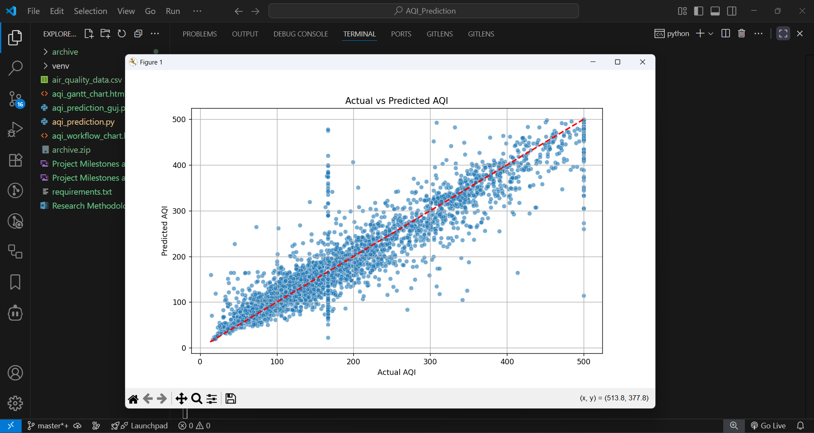
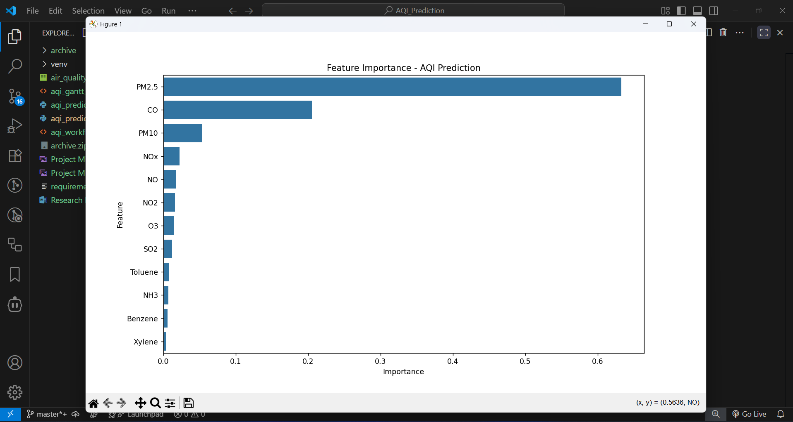
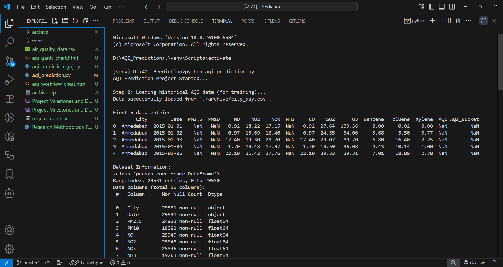
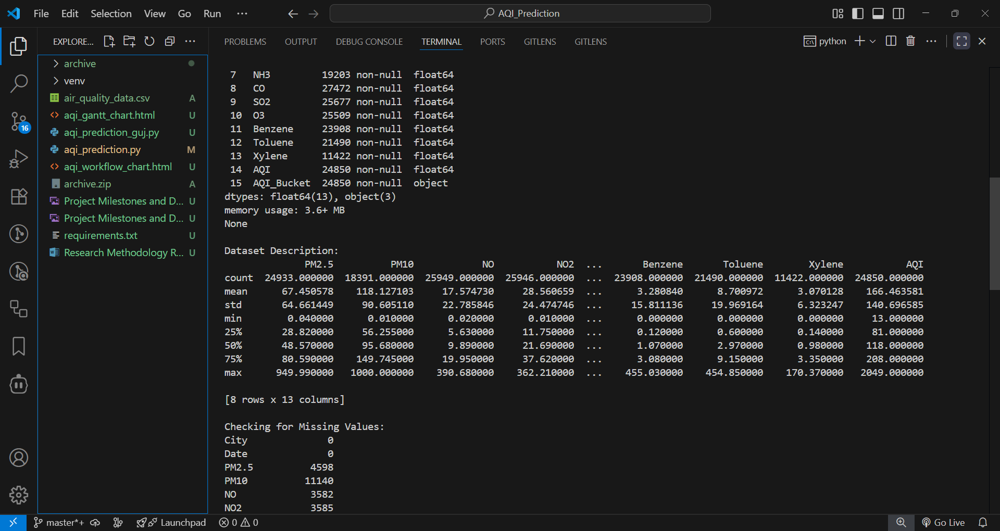
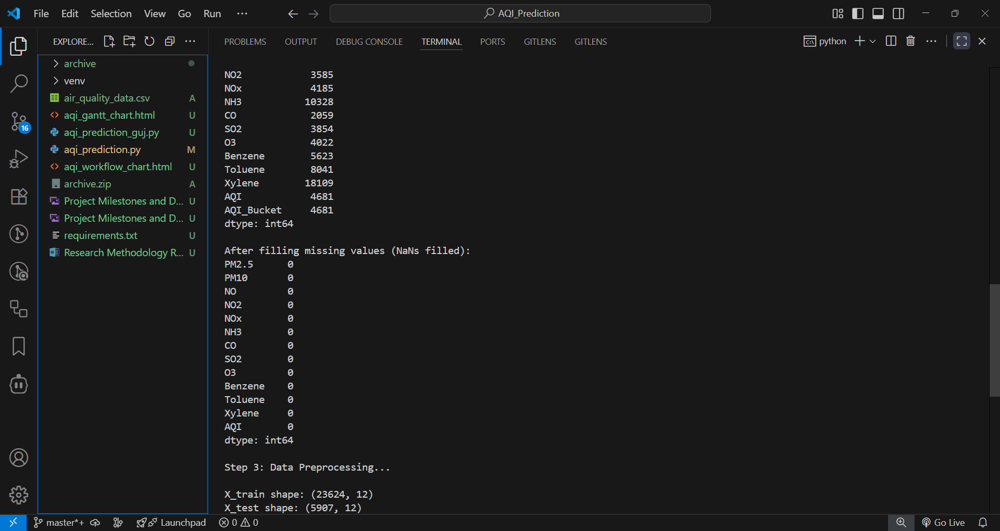
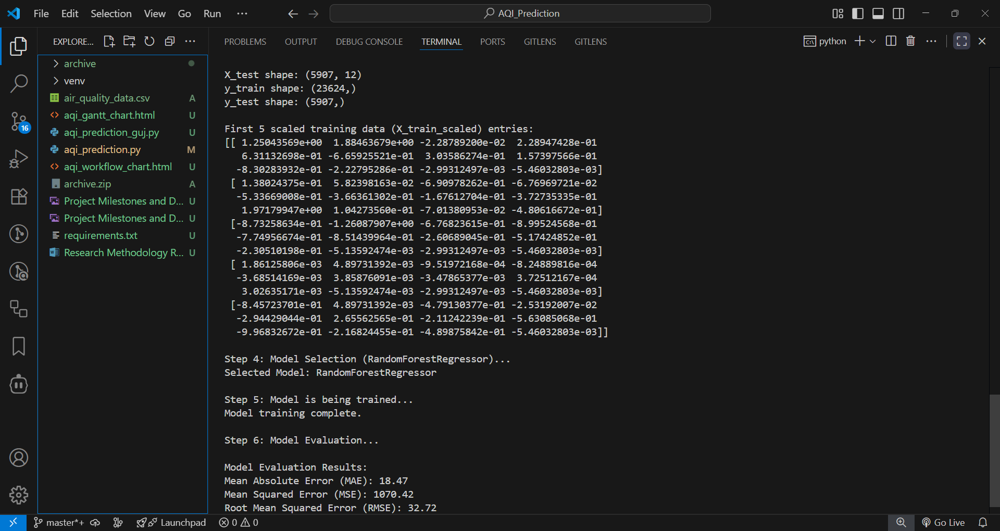
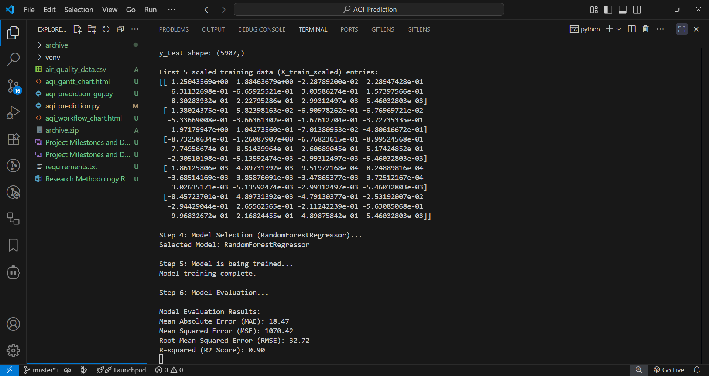

# Air Quality Index (AQI) Prediction using Machine Learning

## Project Overview

This project focuses on developing a Machine Learning model to predict the Air Quality Index (AQI), a crucial indicator of air pollution levels. By leveraging historical air quality data, the model forecasts AQI based on concentrations of various pollutants. This tool aims to assist in public health advisories and environmental management by providing timely and accurate air quality predictions.

## Features

*   **Data Preprocessing:** Handles missing values (NaNs) and scales numerical features for optimal model performance.
*   **Machine Learning Model:** Utilizes the RandomForestRegressor for robust and accurate AQI prediction.
*   **Model Evaluation:** Assesses model performance using standard regression metrics (MAE, MSE, RMSE, R2 Score) and visualizes actual vs. predicted AQI.
*   **Feature Importance Analysis:** Identifies the most influential pollutants contributing to AQI fluctuations.
*   **Prediction on New Data:** Demonstrates the model's ability to forecast AQI for new, unseen pollutant readings.
*   **AQI Categorization:** Classifies predicted numerical AQI into descriptive air quality categories (e.g., Good, Poor).

## Prerequisites

Before running the project, ensure you have the following installed:

*   **Python:** Version 3.9 or higher.
    *   You can download Python from [python.org](https://www.python.org/downloads/). During installation, ensure "Add Python to PATH" is checked.
*   **pip:** Python's package installer (usually comes with Python).

## Setup Instructions

Follow these steps to set up your project environment:

### 1. Create and Activate a Virtual Environment

It is highly recommended to use a virtual environment to manage project dependencies.

**For Windows:**

1.  Open Command Prompt (`cmd`).
2.  Navigate to your project directory:
    ```bash
    cd D:\YourProjectName\AQI_Prediction
    ```
    (Replace `D:\YourProjectName\AQI_Prediction` with your actual project path)
3.  Create the virtual environment:
    ```bash
    python -m venv venv
    ```
4.  Activate the virtual environment:
    ```bash
    .\venv\Scripts\activate
    ```
    You should see `(venv)` at the beginning of your command prompt, indicating the virtual environment is active.

**For Linux / macOS:**

1.  Open Terminal.
2.  Navigate to your project directory:
    ```bash
    cd /path/to/your/project/AQI_Prediction
    ```
    (Replace `/path/to/your/project/AQI_Prediction` with your actual project path)
3.  Create the virtual environment:
    ```bash
    python3 -m venv venv
    ```
4.  Activate the virtual environment:
    ```bash
    source venv/bin/activate
    ```
    You should see `(venv)` at the beginning of your terminal prompt, indicating the virtual environment is active.

### 2. Install Project Dependencies

With your virtual environment activated, install all required Python libraries:

1.  Create a `requirements.txt` file in your project root directory (next to `aqi_prediction.py`) with the following content:
    ```
    numpy
    pandas
    scikit-learn
    matplotlib
    seaborn
    requests
    ```
2.  Install the libraries using pip:
    ```bash
    pip install -r requirements.txt
    ```

### 3. Download the Dataset

The project uses the "Air Quality in India" dataset from Kaggle.

1.  Go to the dataset page on Kaggle: [Air Quality in India Dataset](https://www.kaggle.com/datasets/rohanrao/air-quality-data-in-india)
2.  You will need a Kaggle account to download the dataset. If you don't have one, create it.
3.  Click on the **"Download"** button to get the `.zip` file.
4.  Extract the contents of the `.zip` file. You will find `city_day.csv` inside an `archive` folder.
5.  Create a folder named `archive` inside your project directory (e.g., `D:\YourProjectName\AQI_Prediction\archive`).
6.  Place the `city_day.csv` file inside this `archive` folder. Your project structure should look something like this:
    ```
    AQI_Prediction/
    ├── venv/
    ├── archive/
    │   └── city_day.csv
    ├── aqi_prediction.py
    └── requirements.txt
    ```

## How to Run the Project

Once the setup is complete, you can run the project script.

**For Windows:**

1.  Open Command Prompt (`cmd`).
2.  Navigate to your project directory:
    ```bash
    cd D:\YourProjectName\AQI_Prediction
    ```
3.  Activate the virtual environment:
    ```bash
    .\venv\Scripts\activate
    ```
4.  Run the Python script:
    ```bash
    python aqi_prediction.py
    ```

**For Linux / macOS:**

1.  Open Terminal.
2.  Navigate to your project directory:
    ```bash
    cd /path/to/your/project/AQI_Prediction
    ```
3.  Activate the virtual environment:
    ```bash
    source venv/bin/activate
    ```
4.  Run the Python script:
    ```bash
    python3 aqi_prediction.py
    ```

The script will:
*   Load and preprocess the `city_day.csv` data.
*   Train the RandomForestRegressor model.
*   Evaluate the model's performance on a test set.
*   Display evaluation metrics and two plots (Actual vs Predicted AQI, Feature Importance).
*   Make predictions on a set of new, manually provided sample data.
*   Categorize these predictions into air quality buckets.

## Expected Output

Upon running the script, you will see detailed console output showing each step of the process, including data loading, missing value handling, model training progress, and evaluation results.

Two graphical plots will be displayed:

### 1. Actual vs Predicted AQI

This scatter plot compares the actual AQI values from the test set against the AQI values predicted by the model. A strong model will show data points clustered closely around the red dashed line (which represents perfect prediction where Actual = Predicted).

**(Please insert your `Actual vs Predicted AQI` plot image here)**



### 2. Feature Importance - AQI Prediction

This bar chart illustrates the relative importance of each pollutant (feature) in predicting the AQI. Features with longer bars indicate a greater influence on the model's predictions.

**(Please insert your `Feature Importance` plot image here)**



---

**( Output Screenshot )**












---
